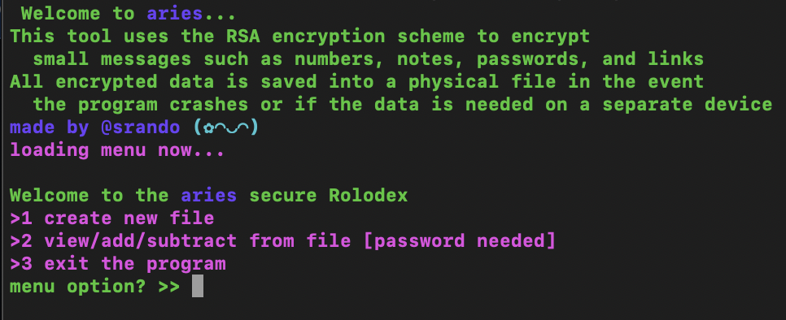

# aries-rsa-rolodex
decrypt-rolodex program allows you to create RSA encrypted messages and save said messages in an external file for later confidential viewing.
 

 
Create a new file by navigating through the menu and view/add to the file after the fact.
